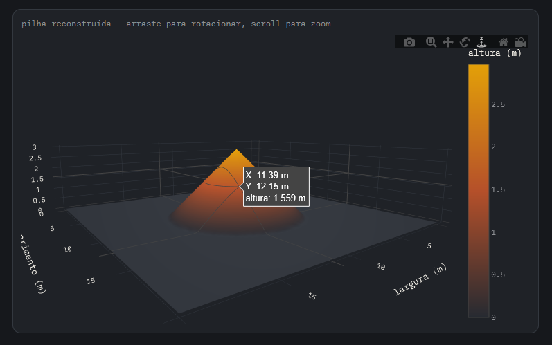

# Duna — Painel Volumétrico de Fertilizante

Sistema para eliminar a estimativa visual do volume de fertilizante armazenado
em boxes, substituindo-a por medição automática a partir de dados 3D — hoje
via câmera de profundidade fixa, com caminho de evolução para fotogrametria
de drone (DEM/Metashape/WebODM).

O princípio matemático é o mesmo do início ao fim do projeto, independente
da fonte de dado: **corte/aterro** — a diferença de altura entre uma
referência vazia e uma leitura carregada, multiplicada pela área de cada
célula de uma grade, somada. É o mesmo método usado por ferramentas
profissionais de "stockpile volume" em GIS.

---



---

## Linha do tempo do projeto (do protótipo ao sistema completo)

| Etapa | O que resolve | Arquivo(s) |
|---|---|---|
| 1. Câmera de profundidade (protótipo) | Prova de conceito do cálculo de volume | `volume_pipeline.py` |
| 2. Sem Open3D | Compatibilidade com Python 3.13/3.14, onde o Open3D não publica wheel | `volume_pipeline_no_open3d.py` |
| 3. Múltiplos boxes | Escalar de 1 para N boxes, com 1 ou várias câmeras | `multi_box_pipeline.py` |
| 4. Visualização 3D interativa | Rotacionar a pilha reconstruída na tela | `volume_pipeline_no_open3d.py` (função `visualizar_interativo`) |
| 5. Dashboard client-side | Cadastro de boxes e cálculo ao vivo, sem backend | `dashboard_volumetrico.html` |
| 6. Drone / DEM (visão de longo prazo) | Prototipagem do fluxo com fotogrametria em vez da câmera fixa | `drone_dem_pipeline.py` |
| 7. Serviço completo (produção) | API real + processamento fotogramétrico via Docker + interface web | `servico/` |

As etapas 1–6 são protótipos de validação, pensados pra rodar sem hardware
real (usam dados sintéticos) e demonstrar o conceito num pitch. A etapa 7
(`servico/`) é a arquitetura real, pensada pra rodar com fotos/DEMs de
verdade.

---

## Estrutura de arquivos

```
.
├── volume_pipeline.py            # protótipo original (câmera + Open3D)
├── volume_pipeline_no_open3d.py  # mesma coisa, sem Open3D (numpy/scipy puro)
├── multi_box_pipeline.py         # adaptação para N boxes simultâneos
├── drone_dem_pipeline.py         # protótipo do fluxo drone -> DEM -> volume
├── dashboard_volumetrico.html    # painel standalone (sem backend), simulado
│
└── servico/                      # SISTEMA REAL, dockerizado
    ├── docker-compose.yml        # orquestra nodeodm + api + interface
    ├── README.md                 # instruções específicas do serviço
    ├── api/
    │   ├── Dockerfile
    │   ├── requirements.txt
    │   └── app.py                # API Flask: fotos ou .tif -> volume
    └── interface/
        ├── index.html            # upload de fotos/.tif + visualização 3D
        └── img/
            └── logo_duna.png     # logo do sistema (adicionar manualmente)
```

---

## Como rodar cada parte

### Protótipos de validação (sem hardware, sem Docker)

```bash
pip install numpy scipy matplotlib plotly --break-system-packages

python3 volume_pipeline_no_open3d.py   # gera saida/pilha_interativa.html
python3 multi_box_pipeline.py          # imprime volume de 3 boxes simulados
python3 drone_dem_pipeline.py          # gera saida/dem_drone_interativo.html
```

Abra os `.html` gerados em `saida/` no navegador — a pilha reconstruída
aparece em 3D, arrastável.

`dashboard_volumetrico.html` não precisa de Python nenhum: é um arquivo
autônomo, abra direto no navegador. Os dados ficam só na sessão (não
salvam ao fechar a aba) — é uma simulação client-side pra demonstrar a
interface, não fala com backend nenhum.

### Sistema completo (produção)

```bash
cd servico
docker compose up --build
```

Sobe 3 containers:
- **nodeodm** (porta 3000) — motor de fotogrametria (Structure from Motion +
  reconstrução densa). Não reimplementamos isso — é o mesmo motor por trás
  do WebODM.
- **api** (porta 5000) — nossa API Flask. Três formas de calcular o volume:
  - `POST /volume/de-fotos` — envia fotos brutas, a API manda pro NodeODM
    processar e calcula o volume do DEM resultante.
  - `POST /volume/dois-tifs` — envia um DEM baseline (vazio) e um carregado
    já prontos (de qualquer fotogrametria) — **método mais preciso**.
  - `POST /volume/de-tif` — envia só um DEM (sem baseline separado) — usa
    uma aproximação (percentil das cotas como "nível do chão").
- **interface** (porta 8080) — página de upload com as 3 opções acima,
  mostrando o resultado numérico e a pilha reconstruída em 3D interativo
  (Plotly, direto no navegador, sem gerar arquivo).

Antes de acessar, copie seu logo para `servico/interface/img/logo_duna.png`
(o cabeçalho da interface já está preparado para exibi-lo).

Veja `servico/README.md` para exemplos de `curl` e mais detalhes de cada
endpoint.

---

## Boas práticas de captura (drone/fotogrametria)

Fertilizante granulado é uma superfície de baixa textura — a fotogrametria
depende de encontrar pontos em comum entre fotos vizinhas, e uma pilha
uniforme de grãos tem poucos pontos distintos pra casar. Isso é compensado
com:

- Sobreposição alta: 80–85% frontal, 70–75% lateral (acima do padrão usado
  em terrenos com textura natural).
- Voo nadir + algumas fotos oblíquas (~15–20°) nas bordas, pra reconstruir
  bem os cantos do box.
- Luz difusa (dia nublado) — sombra forte atrapalha o casamento de pontos.
- Pontos de controle no chão (GCPs) nos cantos do box, se precisão absoluta
  de escala importar (sem isso, o erro de GPS do drone facilmente passa de
  1–3 m sem RTK).

---

## Limitações conhecidas (documentar no pitch)

- **`/volume/de-tif`** (um único DEM) é uma aproximação — assume que a
  maior parte da área escaneada é chão vazio ao redor da pilha. Se o `.tif`
  cobrir só a pilha, o resultado superestima o volume real (validado nos
  testes: ~1.19 m³ pelo método de dois DEMs vs ~1.37 m³ pela aproximação,
  mesma cena).
- **Ruído de reconstrução fotogramétrica** é maior em superfícies uniformes
  (fertilizante) do que em terrenos com textura natural — vale mencionar
  como trade-off consciente, não como falha.
- **`nodeodm` isolado** processa fotos sequencialmente. Para volume de
  produção com muitos voos por dia, considerar o WebODM completo (que já
  tem seu próprio `docker-compose.yml` oficial) em vez de só o NodeODM.
- **Calibração de coordenadas** (onde cada box começa/termina em relação à
  câmera ou ao drone) precisa ser medida manualmente na instalação, ou via
  marcadores fiduciais (ArUco) para algo mais robusto — não é automática
  nesta versão.

---

## Próximos passos sugeridos

1. Testar `/volume/de-fotos` com fotos reais de uma maquete (mesmo que
   tiradas com celular), pra validar o fluxo fotogramétrico completo.
2. Adicionar detecção automática dos cantos do box na nuvem/DEM, em vez de
   coordenadas digitadas manualmente.
3. Evoluir de NodeODM isolado para WebODM completo, se o volume de voos
   por dia justificar.
4. Persistência real dos dados (banco de dados) — hoje a API não salva
   histórico entre chamadas.